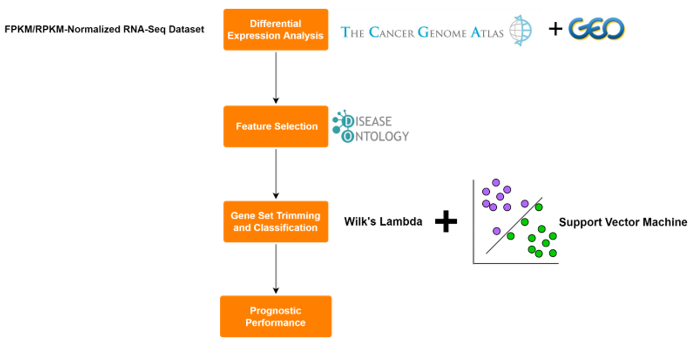

# SVMDO

## Overview
SVMDO is a R package providing Shiny-based web application for extracting disease-associated and normal/tumor tissue sample discriminating gene sets. 



Using FPKM and RPKM normalized RNA-Seq transcriptomics data, the package follows the steps displayed in **Figure-1**:

1. **Differential Expression Analysis**: Extracting differentially expressed genes from RNA-Seq datasets downloaded from either TCGA or GEO databases.
2. **Feature Selection**: Filtration of differentially expressed genes with Disease Ontology Enrichment Analysis.
3. **Gene Set Trimming and Classification**: Wilk's Lambda based discriminative gene set preparation for SVM classification.
4. **Prognostic Performance**: Single gene survival analysis of discriminative sets providing classification.

## Installation

The recent version can be downloaded from [Github repository](https://github.com/robogeno/SVMDO):
```
install.packages("devtools")
library(devtools)
devtools::install_github("robogeno/SVMDO")
```

## Package tutorial
A vignette is available at [this link]vignettes/SVMDO_guide.Rmd . To see the html version, use vignette("SVMDO_guide.Rmd"). Note: if you want to install from Github, please specify build_vignettes = TRUE in install_github.

## Licence and use
SVMDO is a free software; you can redistribute it and/or modify it under the terms of the GNU General Public License 3 (GPL 3) as published by the Free Software Foundation. It is distributed in the hope that it will be useful, but without any warranty and without even the implied warranty of merchantability or fitness for a particular purpose. See the GNU General Public License for more details.
