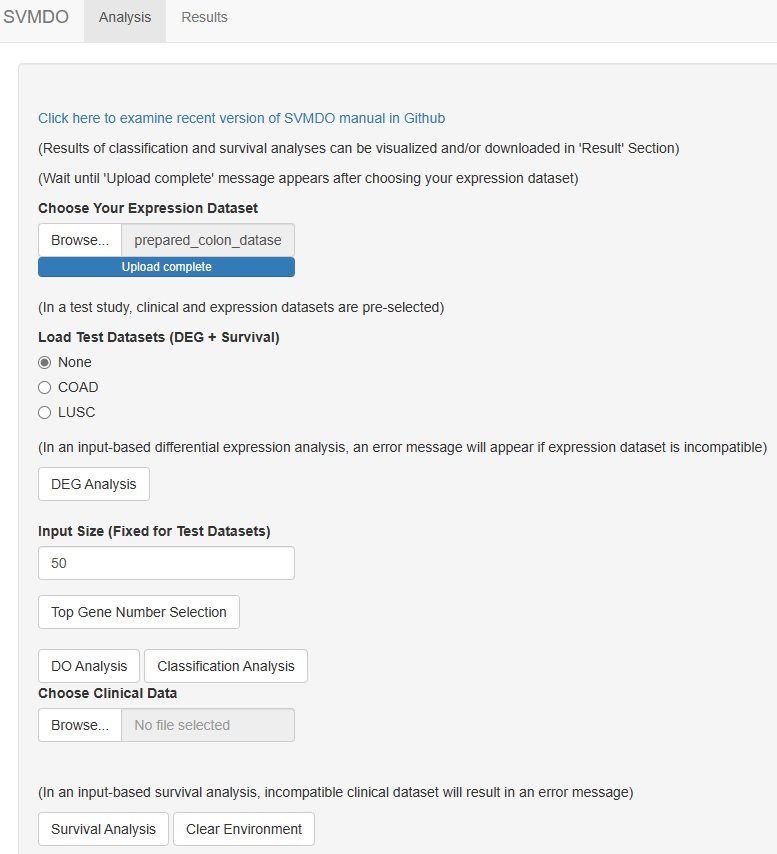

```{r setup, include = FALSE}
knitr::opts_chunk$set(
  collapse = TRUE,
  warning = FALSE,
  comment = "#>",
  cache = TRUE
)


is_windows <- identical(.Platform$OS.type, "windows")
```

# Installation and Package Loading

The day-to-day development version from the [Github
repository](https://github.com/robogeno/SVMDO) can be installed.

```{r install, eval=FALSE}
# From Github 
if (!requireNamespace("devtools", quietly=TRUE))
  install.packages("devtools")
devtools::install_github("robogeno/SVMDO")
```

```{r eval = FALSE}
# From Biocodunctor
if(!requireNamespace("BiocManager", quietly = TRUE))
    install.packages("BiocManager")
BiocManager::install("SVMDO")
```

```{r eval = FALSE}
#library(SVMDO)
#Main screen of GUI
#runGUI()
# OR
#SVMDO::runGUI()
```


# Introduction

Transcriptome-based supervised classification can be difficult to handle
due to including vast amount of junk features reducing the efficiency of
the process. To minimize the efficiency problem, feature selection
methods have been applied [1]. Ensemble methodology in constructing a
feature selection method has been mainly preferred for its better
accuracy in classification processes [2]. Cancer-based studies have been
reported to co-occur with several chronic diseases [3] and oncogenic
viral infections [4]. Disease Ontology (DO) enrichment analysis can
provide a filtration approach through reported diseases that interact
with the gene sets used [5]. Wilk's lambda criterion is one of the
moderate techniques for feature selection. The method combines different
features(genes) step by step based on their contributions to the
discriminating power of overall model [6]. Thus, disease related genes
with better discriminatory characteristics can be acquired. SVMDO is an
easy-to-use GUI using disease information for detecting tumor/normal
sample discriminating gene sets from differentially expressed genes. Our
approach is based on an iterative algorithm filtering genes with disease
ontology enrichment analysis and wilk's lambda criterion connected to
SVM classification model construction. Along with gene set extraction,
SVMDO also provides individual prognostic marker detection. The
algorithm is designed for FPKM and RPKM normalized RNA-Seq transcriptome
datasets. During the development our algorithm, Bioconductor provided a
robust approach for acquiring significant disease-gene interaction
information from disease ontology database.

# Implementation

SVMDO was developed by using Shiny package. It is available for Windows
and Linux from Bioconductor website. SVMDO requires the following R
packages: Shiny, ShinyFiles, golem, nortest, e1071, BSDA, data.table,
sjmisc, klaR, caTools, dplyr, caret, survival, DOSE, AnnotationDbi,
DOSE, org.Hs.eg.db

# Dataset Preparation

RNA-Seq cancer transcriptome and clinical datasets must be prepared
before applying them in SVMDO. The datasets must be used in **txt**
format. The expected designs of input datasets are indicated in Table-1
and Table-2 for transcriptome and clinical datasets respectively.

```{r echo=FALSE}
id<-c("TCGA-AA-3662","TCGA-AA-3514","TCGA-D5-6541","...")
tissue_type<-c("Normal","Normal","Tumour","...")
AB1G<-c("Exp_1","Exp_2","Exp_3","...")
A2M<-c("Exp_1","Exp_2","Exp_3","...")
table_prep_1<-data.frame(id,tissue_type,AB1G,A2M)
```

`r knitr::kable(table_prep_1,"pipe",col.name=c("id","tissue_type","AB1G","A2M"),align = "cccc",caption="Structure of RNA-Seq Transcriptome Dataset")`

```{r echo=FALSE}
id<-c("TCGA-AA-3662","TCGA-AA-3514","TCGA-D5-6541","...")
days_to_death<-c(49,1331,225,"...")
vital_status<-c("Alive","Dead","Dead","...")
table_prep_2<-data.frame(id,days_to_death,vital_status)
```

`r knitr::kable(table_prep_2,"pipe",col.name=c("id","days_to_death","vital_status"),align = "cccc",caption="Structure of Clinical Dataset")`

-   **tissue_type:** Normal/Tumour (or Tumor) Tissue Information
-   **A1BG, A2M:** Gene Symbol and Gene Expression
-   **id:** TCGA Sample Ids
-   **days_to_death:** Survival Time of Patients
-   **vital_status:** Vitality of Patients

Using **tissue_type** and **id** as column names for representing tissue
information and TCGA sample id is **mandatory**. If there is not any
requirement for **survival analysis**, preparation of **clinical
dataset** and involvement of **id** column in the transcriptome dataset
are optional.

# SVMDO GUI Description

The main dialog box is indicated in **Figure-1**. The GUI page consists
of two main sections which are "Analysis" and "Result". In the Analysis
section, steps of acquiring discriminative gene set and preparations of
individual survival plots are included. In the Result section,
visualization and download of discriminative gene set and survival plots
are included. At each step of the GUI sections, necessary variables are
saved as objects in the workspace environment to be used in the
following steps. To provide experience about the GUI usage, a test
section involving dummy example using SummarizedExperiment objects of
transcriptome (small form) and clinical datasets is also included.

```{r, ,echo=FALSE,  width = 200, height = 50,fig.align = "center",fig.show='hold'}
# two figs side by side

```

<br><br><br>

```{r, ,echo=FALSE,  width = 200, height = 50,fig.align = "center",fig.show='hold',fig.cap='Figure-1 SVMDO GUI Sections'}
# two figs side by side

```

# How to open SVMDO Main Screen

To open GUI screen, you can directly write **SVMDO::runGUI()** in R
console. If library is previously activated you can open GUI screen by
writing **runGUI()** in R console.

# How to use SVMDO Main Screen

(**Important:** Except file input processes, each step provides a
message box indicating process success/failure. It disappears after
clicking on any area in the GUI screen. This is necessary for continuing
the steps.)

## Steps of Analysis Screen

1.  To search your transcriptome dataset, use the file detection in
    **Choose Your Expression Dataset** section. The file will be
    automatically uploaded into the GUI.
2.  To prevent clashing with test datasets, select **"None"** option
    from the radio button section.
3.  By clicking on **DEG Analysis** button you further apply
    differential expression analysis. Labels of tissue_type column in
    dataset must contain "Nor" and "Tum" for determining normal/tumour
    (or tumor) samples.
4.  When the differential expression process is completed, a
    user-defined input size (n) is selected to filter the initial gene
    list (i.e., n number of upregulated and downregulated genes) by
    entering a number in **Input Size** section. It is predetermined as
    **50** in GUI which can be changed based on the user. A message
    window saying **process completed** will appear if there is not any
    problem. If there is problem with the value of input size, you will
    get a warning about inappropriate input size selection. If the input
    size remains, algorithm selects all of the differentiallly expressed
    genes to be used in the next process.
5.  To apply disease ontology-based gene filtration, click on **DO
    Analysis** button.
6.  To further apply the following feature selection and classification
    processes, click on the **Classification** button.
7.  Acquired discriminative gene set can be further used for survival
    analysis to detect individual prognostic genes. To apply this
    process, use the file detection in **Choose Clinical Data** section
    for searching clinical data about patient survival followed by
    clicking on **Survival Analysis** button.

## Steps of Result Screen

1.  To visualize discriminative gene sets inside GUI screen, click on
    **Show Gene Results** button. When you click this button, a table of
    gene set will appear.
2.  To visualize survival plots of individual genes, two steps have to
    be applied. First of all, click on **Prepare Plot Lists** button to
    feed plot information to the visualization system. After that, click
    on **Show Plots** button to visualize survival plots.
3.  Before downloading files, you can adjust the output directory with
    **Choose Directory** button. It can be used for separating files by
    selecting a destination before clicking download buttons. If it is
    desired, files can be downloaded to the same folder by selecting an
    output directory just one time before the download steps. If you do
    not select any output directory, files will be downloaded to your
    **working directory**.
4.  To download the resulting discriminative gene set, it is obligatory
    to define a filename in the **Enter Final Gene Set Filename**
    section. After that, you can click on **Download Gene List** button
    to complete the process.
5.  To download survival plots, you have to click on **Download Plot
    List** button. Names of plot files are automatically done by
    assigning gene names.

# Application of test datasets

SVMDO includes test datasets providing dummy examples for gaining experience on the GUI usage. Test datasets consists of summarized experiment objects including expression and clinical datasets. These objects are saved in RDA forms and called from **extdata** folder of the package. As expression datasets, test files includes simplified forms of TCGA-COAD (COAD) and TCGA-LUSC (LUSC) with 400 genes In test-based analysis, predetermined expression and clinical datasets are automatically uploaded into the GUI. Furthermore, predefined input size (n=50) is also automatically applied. Therefore, users have to continue with **DO Analysis** after **DEG Analysis** without adjusting input size.

# Workspace Clearance

When the user task is completed, click on the **Clear Environment**
button to remove the global variables created during the algorithm
sections. To prevent error in the next usages of GUI, it is a necessary
process. It can be applied at any moment without the necessity of
completing all of the steps of algorithm.

# Output Files of SVMDO

-   **Discriminative Gene Set:** Final form of gene set providing
    optimal classification performance
-   **Individiual Survival Plots:** Separate survival plots of
    individual genes with prognostic performance

# References

1.  Cai,J. et al. (2018) Feature selection in machine learning: A new
    perspective. Neurocomputing, 300, 70--79.
2.  Gallagher,E.J. and LeRoith,D. (2015) Obesity and diabetes: The
    increased risk of cancer and cancer-related mortality. Physiological
    Reviews, 95, 727--748.
3.  Kori,M. and Arga,K.Y. (2020) Pathways involved in viral oncogenesis:
    New perspectives from virus-host protein interactomics. Biochimica
    et Biophysica Acta (BBA) - Molecular Basis of Disease, 1866, 165885.
4.  LePendu,P. et al. (2011) Enabling enrichment analysis with the human
    disease ontology. Journal of Biomedical Informatics, 44, S31--S38.
5.  Liu,B. et al. (2004) BMC Bioinformatics, 5, 136.
6.  Ouardighi,A. el et al. (2007) Feature selection on supervised
    classification using wilks lambda statistic. In, 2007 international
    symposium on computational intelligence and intelligent informatics.
    IEEE.

# How to install R and RStudio GUI

RStudio requires R 3.3.0+. Choose a version of R that matches your
computer's operating system

## Windows Operating System

\*\*R-base Install:

1.  Copy/Paste the address <https://posit.co/download/rstudio-desktop/>
2.  Click on "Download and install R"
3.  In the new page, click on "Download R for Windows"
4.  Click on "install R for the first time"
5.  Click on "Download R-X.X.X-win.exe for Windows"to install R-base

\*\*RStudio Install:

1.  Copy/Paste the address <https://posit.co/download/rstudio-desktop/>
2.  Click on either download RStudio desktop for windows
3.  Alternatively, .exe /.zip versions can be downloaded from All
    Installers section

## Ubuntu Operating System

\*\*R-base Install:

1.  Copy/Paste the address <https://posit.co/download/rstudio-desktop/>
2.  Click on "Download and install R".
3.  Click on "Download R for Linux"
4.  In the parent directory, click on ubuntu/
5.  Run the following lines in terminal (as root or by prefixing sudo)
    to provide access to recent version of R:

-   sudo apt install --no-install-recommends software-properties-common
    dirmngr \# add the signing key (by Michael Rutter) for these repos
    \# To verify key, run gpg --show-keys
    /etc/apt/trusted.gpg.d/cran_ubuntu_key.asc \# Fingerprint:
    E298A3A825C0D65DFD57CBB651716619E084DAB9
-   wget -qO-
    <https://cloud.r-project.org/bin/linux/ubuntu/marutter_pubkey.asc>
    \| sudo tee -a /etc/apt/trusted.gpg.d/cran_ubuntu_key.asc \# add the
    R 4.0 repo from CRAN -- adjust 'focal' to 'groovy' or 'bionic' as
    needed
-   sudo add-apt-repository "deb
    <https://cloud.r-project.org/bin/linux/ubuntu> \$(lsb_release
    -cs)-cran40/"

5.  After the previous lines, run sudo apt install
    --no-install-recommends r-base

\*\*RStudio Install:

1.  Copy/Paste the address <https://posit.co/download/rstudio-desktop/>
2.  In All Installers section, select .deb or .debian.tar.gz version for
    Ubuntu
3.  Right click on the download and/or unzipped .deb file to install
    RStudio (Alternatively, .deb file can be installed from terminal by
    typing sudo dpkg -i installed_Rstudio_file.deb)

# Session Info

```{r SessionInfo, eval=TRUE, message=FALSE, echo=FALSE}
sessionInfo()
```
